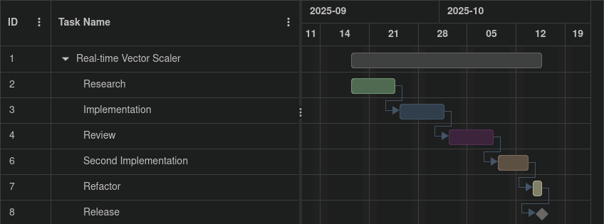

# Project Progression

- Kenechukwu Ozoemene: 100841149

- Group: Solo

- Github repository: [GitHub - Teaching-myself-Godot/ez-curved-lines-2d](https://github.com/Teaching-myself-Godot/ez-curved-lines-2d)

> **_NOTE:_**  The use of other code is fully referenced in the github repository. All documentation was a community effort, and I had majority say in the documentation of the real-time SVG scaling system.

## Group Formation

- My course project is a solo endeavour which started off as a personal project/ contribution to a larger project aiming to solve the same problem I'm tackling, and as a  result, I chose to work solo because my project was already an established tool used in projects.

- Roles/ Responsibilities: All development.

> **_NOTE:_**  Although this is a solo project in the view of this course, by nature of this code being a part of a larger open source codebase, I am bound by changes and restrictions of that codebase. This includes contributions from participants not in this course.

## Interactive Media Scenario Information

- Project information: This project aims to bring the power of real-time scalable vector graphics to average game development envirionments in open source game engines like the Godot game engine.

- Project goals: First, aim to reduce the file sizes of game/ project textures. Second, bring back the clean crisp texturing that was previously available in  the early web during the Macromedia/ Adobe flash era. Third, avoid reimplementing the same performance mistakes present in the flash era. Finally, bring the full benefits of the SVG (Scalable Vector Graphics) stack to game and interactive media developers.

- Project purpose: My aforementioned project is aimed to be a developer focused tool first, and as such, my deliverables will be tailored to that experience.

## Developer Expectations (Target Audience)

- Developers should be able to implement scalable vector graphics in their projects without changing their work flow.

- Developers should be able to ship their projects to all target platforms available in the Godot game engine, this includes: HTML5 (web), Linux, Windows, Android, iOS, MacOS.

- Implementation of scalable graphics should take little to no code, and should all be available in the game engine editor.

- User Interfaces (UI) should also be easy to develop with the new system.

- Fallback raster graphics in case of render failures, should be feasible/ implemented by default.

> **_NOTE:_**  Due to the nature of this codebase being a contribution to a larger project, I will be focusing on the SVG scaling rendering system as that was my main focus during the course of development.

## Scene Screenshots

*Setting scalable image in the Godot 4 inspector*

## Implementations

> **_NOTE:_** Due to the fast moving pace of the project, some of these implementations are now outdated, or had to be changed to meet project criteria.

### Singleton

- I implemented a now *depricated* SVG manager as my singleton. This was initialized by a separate plugin manager singleton that loaded the SVG manager into the engine project settings upon initialization, and removed it from the project on close. The SVG managers job was to track caches of SVG draw requests throughouth the project, compile that list into a structured object, and split the computation of rendering vector graphics on multiple cores on a machine. The secondary job of the SVG manager was to handle thread cleanups related to vector graphic rendering.

- My justification for this implementation was to optimize real-time vector graphics rendering in a future-proof fashion. This would have led to the full utilization of future CPU architectures when parsing the SVG XML, leading to a design that would improve alongside hardware improvements. This unfortunately had to be cut due to CORS (Cross Origin Resource Sharing) having a major impact on how WebAssembly projects can be shared on the web.

**Sequence Diagram**

---

## Command Pattern

- With how "engine native" we wanted the SVG rendering system to feel, I decided to use a node based approach for the `SVGTextureHelper` and `SVGTextureResource` classes.

- The `SVGTextureResource` is an engine native resource type I developed that stores all the SVG data needed to perform all the vector calculations. It also stored additional properties that gave developers more power to optimize larger SVGs such as the rasterized image resolution. This was also the key to file size reduction, in the way that it parsed the provided SVG XML and bypassed Godot's rasterizer.

- The `SVGTextureHelper` took an `SVGTextureResource` as an input parameter and acted as the intermediary between the developer, Godot, and native nodes that take natively supported texture types. This significantly cut development time for users of the plugin, as well as giving them a choice between our solution, rasterized graphics, or a combination of both.

- With the implentation of these classes, and how neatly they hooked into the engine workflow, and interface, it was trivial to link changes made to them to the editor `UndoRedo` interface.

**Sequence Diagram**

---

## Factory Pattern

- As mentioned earlier in the command pattern category, this came natively due to my implementation approach. Rather that needing developers to manually create and save an `SVGTextureResource` when using adding a texture to any object, clicking on the texture section of the `SVGTextureHelper` input field automatically creates a new resource that can be populated via the Godot engine's new quick file picker dialogue.

- Things were mainly implemented this way to save time for the developers using our plugin, and to further legitimize the "engine native" philosophy I briefly touched on earlier.

**Sequence Diagram**

---

## Combined Overview – Pattern Integration

The following diagram summarizes the interplay between the **Singleton**, **Command**, and **Factory** patterns in the SVG rendering subsystem.  
It demonstrates how the plugin bootstraps through the `PluginManager` (Singleton), produces reusable resources via the `SVGResourceFactory` (Factory), and ties user actions to the editor workflow using the `ApplySVGTextureCommand` (Command).

---

**Sequence Overview**

This sequence diagram provides a runtime flow of how the patterns interact across the plugin’s lifecycle — from plugin startup to user texture application.

---

## Plugin/DLL

- Considering the fact that this project is a massive plugin itself with an expansive history, starting off as an off-hand plugin made to satisfy the request of Prof. Gavin Ball during a game jam, to something that got forked by another party and turned into a moderately bigger project, which later led to the inspiration and creation of the final project by another party, ultimately leading to the latest and greatest version that I am now contributing to. I'd argue that the plugin is not just best suited for a course project, but has been useful to both my GDW and professional projects, alongside the projects of over 100 individuals/ teams that make use of the Godot game engine.
